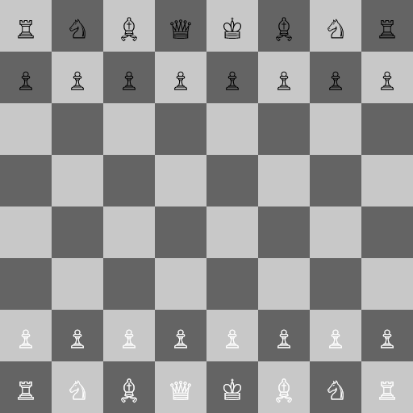

A chess board created with Javascript and <a href="https://p5js.org/">P5JS</a>. 

This is a hobby project made for learning more programming and how chess engines work. I choose Javascript because I also want to learn more about
P5JS.

